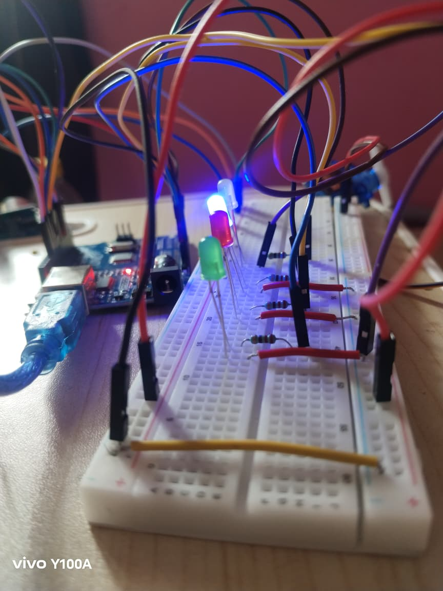
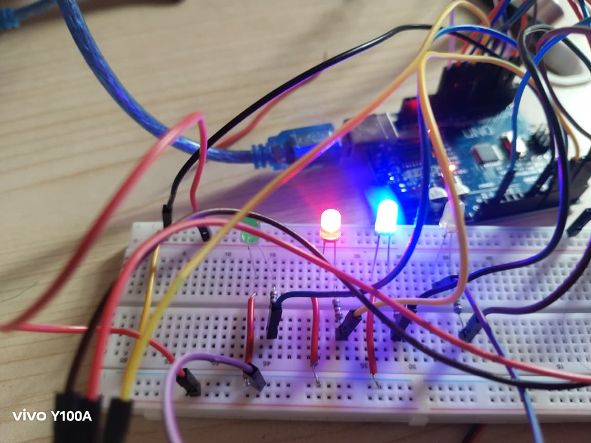
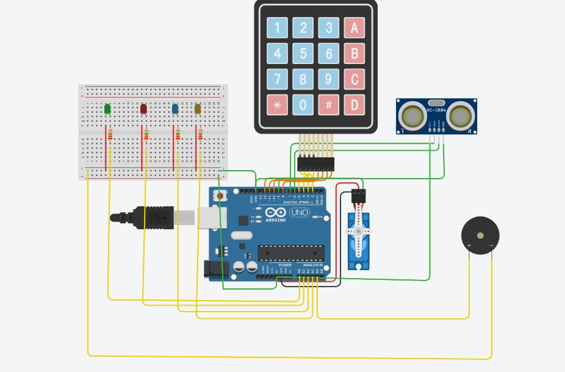
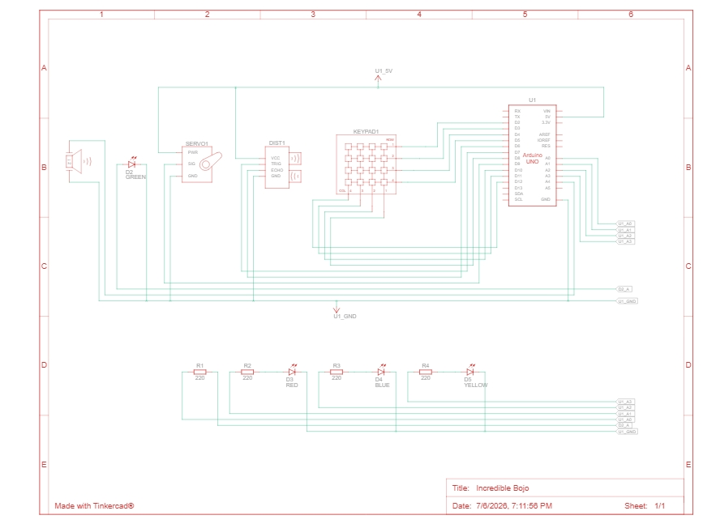

# 🔐 Smart Door Lock System using Arduino UNO

## 📌 Overview
A smart door lock system built using Arduino UNO. The system detects a person using an ultrasonic sensor and allows access only after entering the correct password through a 4x4 keypad.

---

# ✨ Features

- Password protected access
- Ultrasonic person detection
- Servo motor door lock
- Green LED - Access Granted
- Red LED - Wrong Password
- Blue LED - Person Detection
- Yellow LED - Security Lockout
- Buzzer alarm after 3 wrong attempts
- Automatic door locking after 5 seconds

---

## 🛠 Components Used

- Arduino UNO
- 4×4 Keypad
- Servo Motor
- HC-SR04 Ultrasonic Sensor
- 4 LEDs
- Active Buzzer
- Breadboard
- Jumper Wires
- 220Ω Resistors

---

## 📷 Project Images

### Hardware Setup

## 🔌 Circuit

### Tinkercad Circuit

### Schematic

- **Tinkercad Simulation:** https://www.tinkercad.com/things/hucc4F73z2d-incredible-bojo

## 🎥 Demo

The project demonstration video is available here:

[▶️ Watch Demo](Videos/demo1.mp4)
[▶️ Watch Demo](Videos/demo2.mp4)

## 📂 Project Structure

Smart-Door-Lock-Arduino
├── Smart_Door_Lock.ino
├── README.md
├── Images/
├── Videos/
└── Circuit/

---

## 🔑 Password

Default Password: `9999`

---

## 💻 Technologies Used

- Embedded C
- Arduino IDE
- Sensor Interfacing
- Servo Motor Control
- Password Authentication

---

## 🚀 Future Improvements

- RFID Authentication
- Bluetooth Mobile Control
- OLED/LCD Display
- Fingerprint Sensor
- IoT Monitoring
